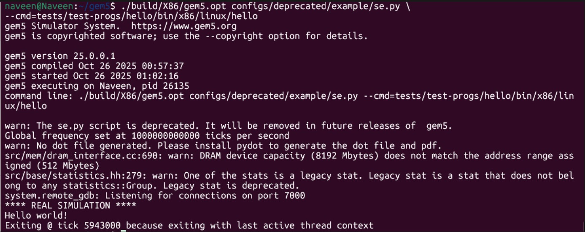

# gem5-setup
This repository documents the "process for building and running gem5 simulations".
# gem5 Setup and Installation

## Introduction
The gem5 simulator is an open-source tool used for modeling and studying computer architectures. It supports x86, ARM, and RISC-V systems and helps researchers analyze CPU, memory, and cache performance.

## Environment Setup
To install dependencies on Ubuntu or WSL:

sudo apt install -y build-essential python3 python3-pip scons \
m4 zlib1g-dev libprotobuf-dev protobuf-compiler git

## Building gem5
git clone https://github.com/gem5/gem5.git
cd gem5
scons build/X86/gem5.opt -j$(nproc)

## Running Simulation
./build/X86/gem5.opt configs/deprecated/example/se.py \
--cmd=tests/test-progs/hello/bin/x86/linux/hello

## Output:

Hello world!
Exiting @ tick 5943000 because exiting with last active thread context

After running the hello world simulation:

